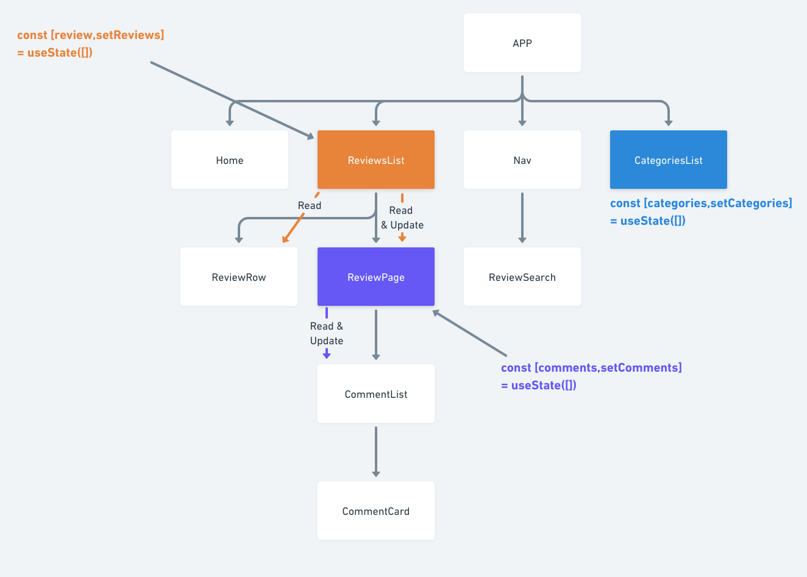
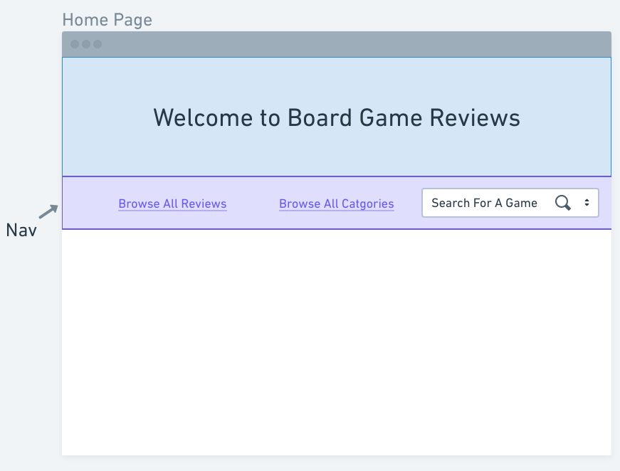
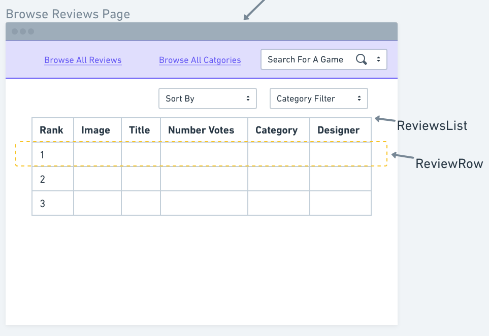
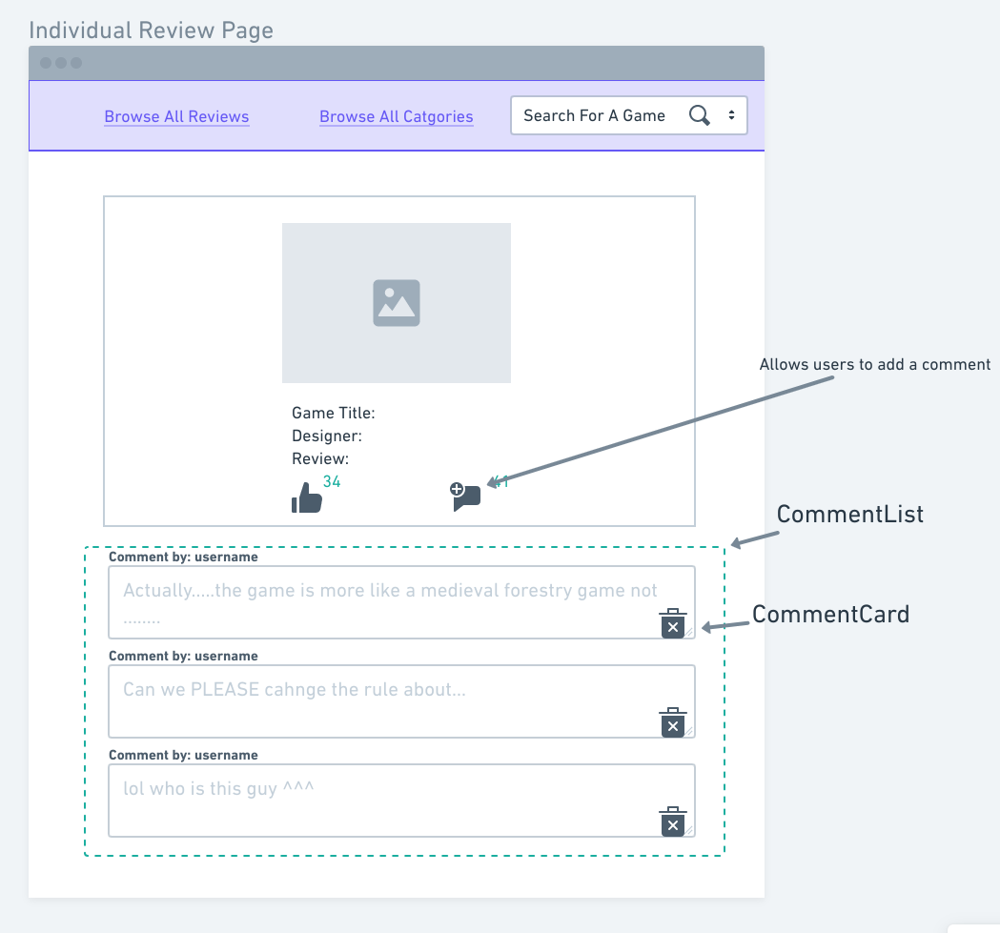
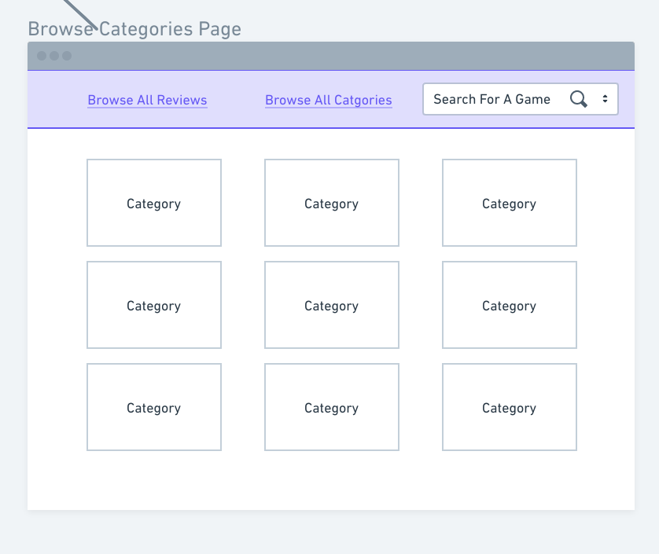

# POA

The application will have the following components.
- App
- Home
- Nav
    - ReviewSearch
- CategoriesList
- ReviewsList
    - ReviewRow
    - ReviewPage
        - CommentList
            - Comment
## Heirarchy

## Pages
The application will have the following pages.

### Home Page
This page hosts a welcome message as well as a navigation bar. The welcome page may host more content in the future once more of the application has been developed.

### Review List Page
This page hosts a list of ALL the reviews from the get /api/reviews endpoint. It it intended to render this as a table component, with functionality to sort and filter the table. The tables will link to individual review cards.

### Individual Review Page
This page is intended to be used for each individual review from the reviews list. Each review will display further information about the game review. There will also be the functionality to vote for this review and add a comment.

Below each review I intend to render a list of all the comments associated with the individual review via a CommentList component, containing individual comment cards. Comments will be deletable in this list also.

### Categories List
Finally I intend to render a list of categories as a separate page. Each category when clicked will render a list of reviews in this category.

I plan to redirect the user back to the existing ReviewList component with a filter applied to the table.

